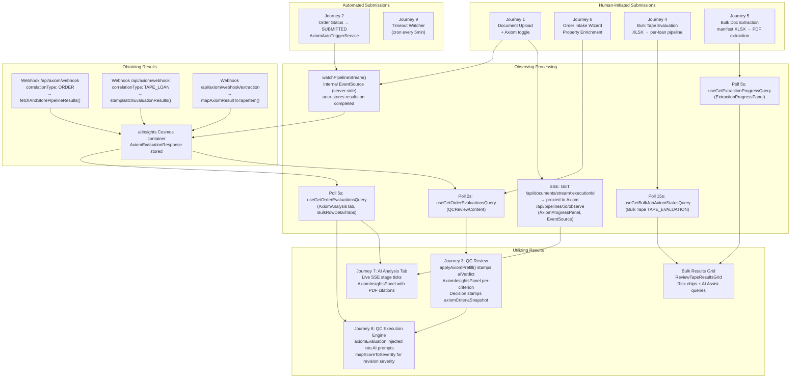
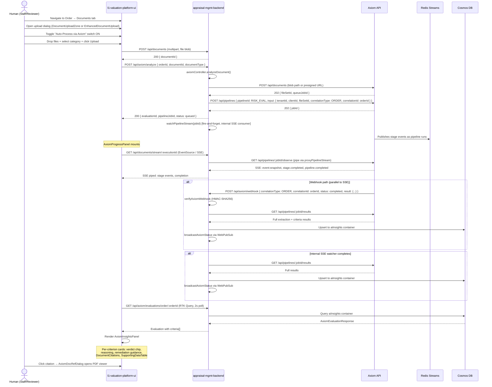
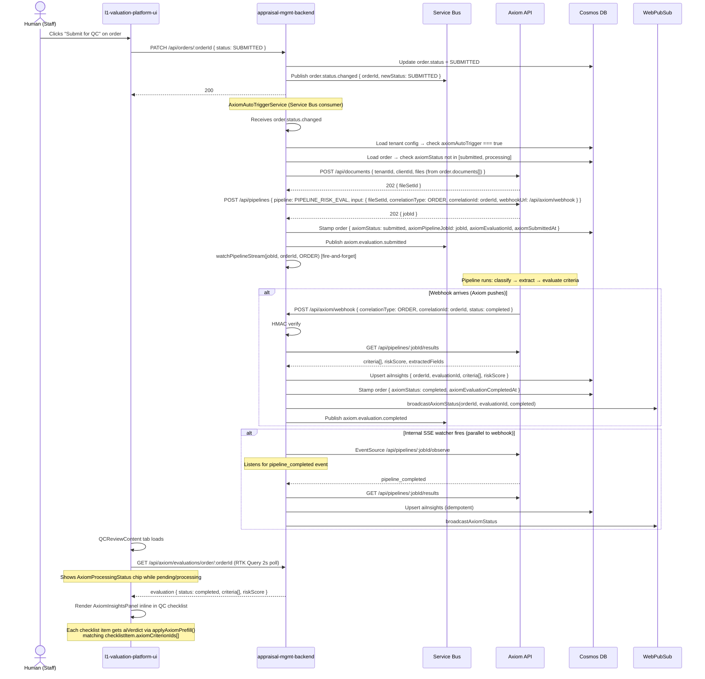
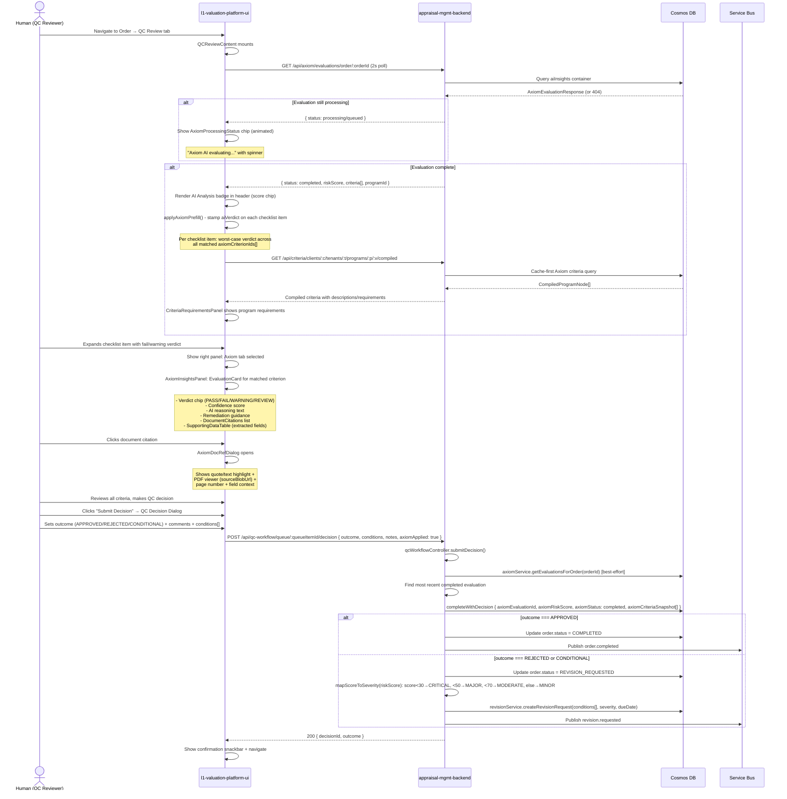
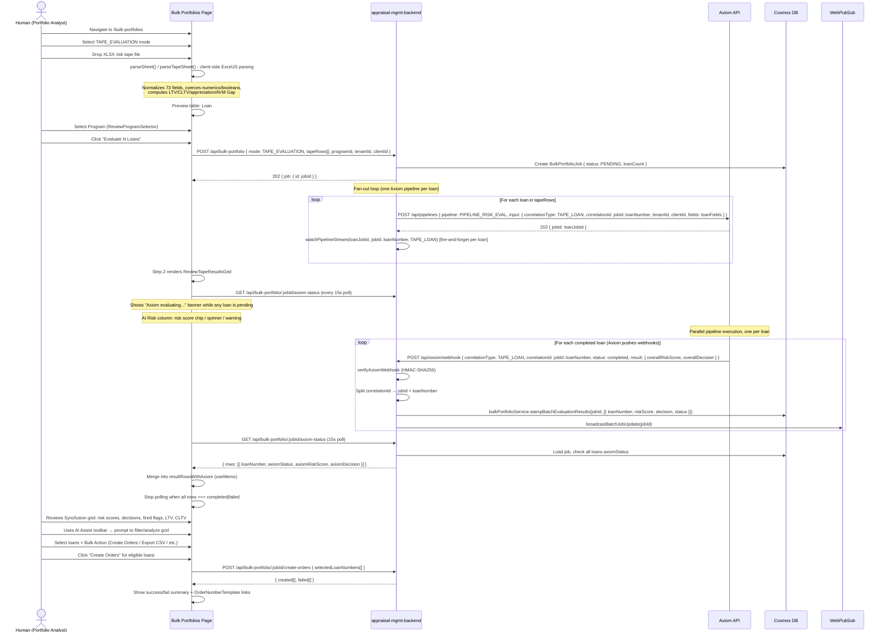
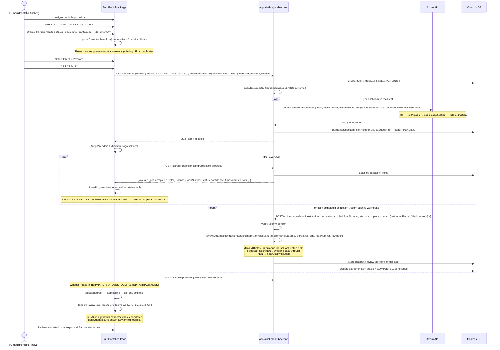
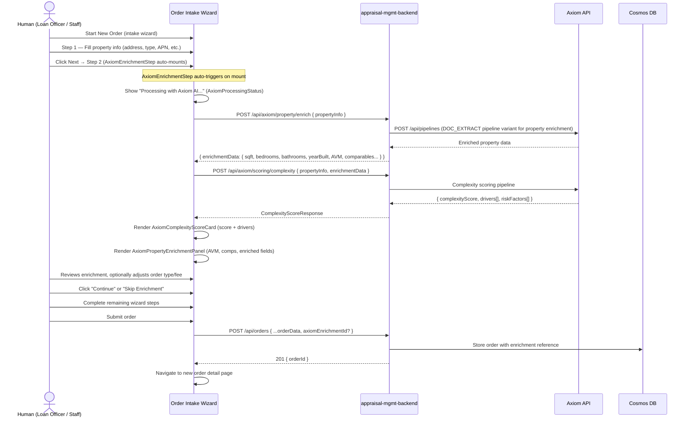
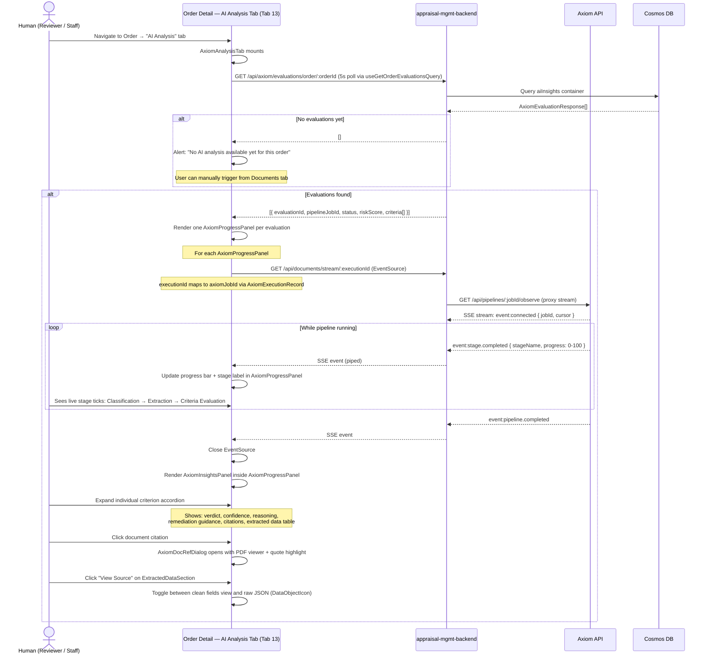
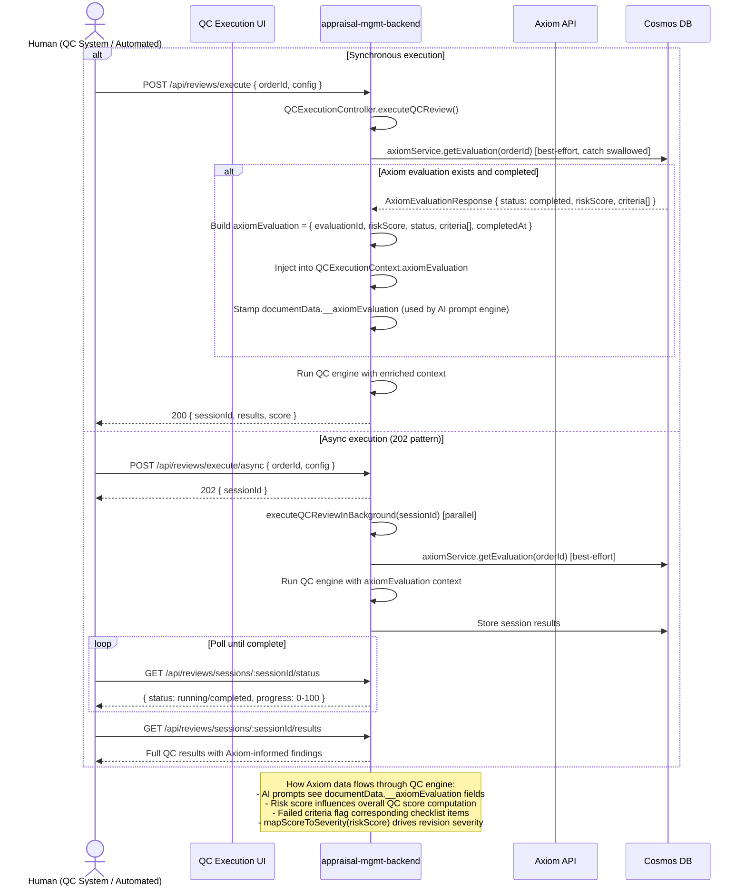
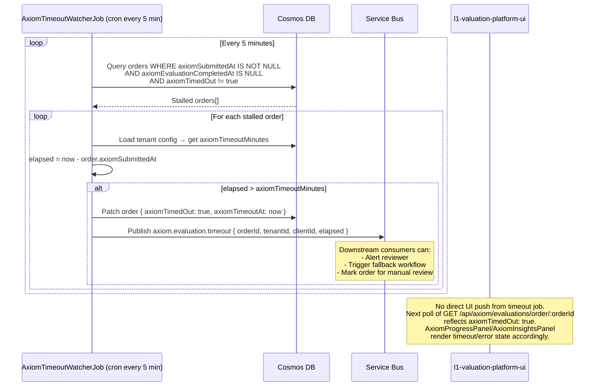

Upload a BPO PDF to blob storage in the documents container# Axiom Integration — Complete Journey Maps

> **Generated:** March 25, 2026  
> **Source:** Verified against actual source code in `appraisal-management-backend/src` and `l1-valuation-platform-ui/src`  
> **Axiom API base:** `https://axiom-dev-api.ambitioushill-a89e4aa0.eastus.azurecontainerapps.io`

---

## Overview — All Journeys at a Glance
Upload a BPO PDF to blob storage in the documents container

---

## Observation Mechanisms — Quick Reference

| Mechanism | Component / Code | Interval | Journeys |
|---|---|---|---|
| **Live SSE (frontend)** | `AxiomProgressPanel` → `EventSource` → `GET /api/documents/stream/:id` → proxied to Axiom `/observe` | Real-time push | 1, 7 |
| **Internal SSE (server-side)** | `watchPipelineStream()` — `EventSource` from `eventsource` npm package | Event-driven, 30-min timeout | 1, 2, 4 |
| **Poll 2s** | `useGetOrderEvaluationsQuery` in `QCReviewContent` | 2 000 ms | 3 |
| **Poll 5s** | `useGetOrderEvaluationsQuery` in `AxiomAnalysisTab` + `BulkRowDetailTabs` | 5 000 ms | 4, 7 |
| **Poll 5s** | `useGetExtractionProgressQuery` in `ExtractionProgressPanel` | 5 000 ms | 5 |
| **Poll 15s** | `useGetBulkJobAxiomStatusQuery` in bulk portfolios page | 15 000 ms, stops on all-terminal | 4 |
| **Webhook (ORDER)** | `POST /api/axiom/webhook` → `fetchAndStorePipelineResults()` | Axiom-pushed | 1, 2 |
| **Webhook (TAPE_LOAN)** | `POST /api/axiom/webhook` → `stampBatchEvaluationResults()` | Axiom-pushed per loan | 4 |
| **Webhook (extraction)** | `POST /api/axiom/webhook/extraction` → `mapAxiomResultToTapeItem()` | Axiom-pushed per loan | 5 |

---

## Axiom Pipeline Modes

| Mode constant | Loom pipeline used | Stages |
|---|---|---|
| `FULL_PIPELINE` | `PIPELINE_RISK_EVAL` | `DocumentProcessor` → `CriterionEvaluator` |
| `EXTRACTION_ONLY` | `PIPELINE_DOC_EXTRACT` | `DocumentProcessor` |
| `CRITERIA_ONLY` | `PIPELINE_BULK_EVAL` | `CriteriaLoader` → `CriterionEvaluator` → `ResultsAggregator` |

Override any pipeline with env var `AXIOM_PIPELINE_ID_RISK_EVAL`, `AXIOM_PIPELINE_ID_DOC_EXTRACT`, or `AXIOM_PIPELINE_ID_BULK_EVAL` to use a registered Axiom template UUID instead of the inline Loom JSON.

---

## Webhook Correlation Types

| `correlationType` | `correlationId` format | Handler | Result storage |
|---|---|---|---|
| `ORDER` | `orderId` | `handleWebhook` in `axiom.controller.ts` → `fetchAndStorePipelineResults()` | `aiInsights` Cosmos container |
| `TAPE_LOAN` | `{jobId}::{loanNumber}` | `handleWebhook` → split on `::` → `stampBatchEvaluationResults()` | `BulkPortfolioJob.results[n]` in Cosmos |
| `BULK_JOB` | `jobId` | `handleBulkWebhook` | `BulkPortfolioJob` status |
| `EXECUTION` | `executionId` | `handleWebhook` → `AxiomExecutionService.updateExecutionStatus()` | `axiom-executions` Cosmos container |

All webhooks verified via HMAC-SHA256 on `x-axiom-signature` header using `AXIOM_WEBHOOK_SECRET`.

---

## Journey 1 — Document Upload with Axiom Analysis (Human-Initiated)

**Entry points:** Order detail → Documents tab → `DocumentUploadZone` or `EnhancedDocumentUpload`  
**Key components:** `DocumentUploadZone.tsx`, `EnhancedDocumentUpload.tsx`, `AxiomProgressPanel`, `AxiomInsightsPanel`  
**Backend entry:** `POST /api/axiom/analyze` → `axiomController.analyzeDocument()`  
**Axiom pipeline:** `PIPELINE_RISK_EVAL` with `correlationType: ORDER`

### Key notes
- `DocumentUploadZone` defaults `isAxiomEnabled = false`; `EnhancedDocumentUpload` defaults `isAxiomEnabled = true`
- Both the webhook path AND the internal `watchPipelineStream()` write to `aiInsights` — idempotent upsert, whichever arrives first wins
- SSE proxy: `GET /api/documents/stream/:executionId` → resolves `executionId` → `axiomJobId` via `AxiomExecutionRecord` → `proxyPipelineStream()` pipes raw Axiom stream

---

## Journey 2 — Automated Axiom Trigger on Order Submission

**Entry point:** Any user action that sets order status → `SUBMITTED` (e.g. "Submit for QC" button)  
**Key service:** `AxiomAutoTriggerService` — Service Bus consumer on `order.status.changed`  
**Guard:** Tenant config `axiomAutoTrigger === true` + order `axiomStatus` not already `submitted`/`processing`  
**Axiom pipeline:** `PIPELINE_RISK_EVAL` with `correlationType: ORDER`

### Key notes
- Fields stamped on the order document: `axiomStatus`, `axiomPipelineJobId`, `axiomEvaluationId`, `axiomSubmittedAt`
- Fields stamped on completion: `axiomStatus: completed`, `axiomEvaluationCompletedAt`
- Service Bus events emitted: `axiom.evaluation.submitted`, `axiom.evaluation.completed`
- No human interaction required after the initial "Submit for QC" click

---

## Journey 3 — QC Review with Axiom Insights (Human QC Reviewer)

**Entry point:** Order detail → QC Review tab (Tab 9)  
**Key components:** `QCReviewContent.tsx` (1,612 lines), `AxiomInsightsPanel.tsx` (888 lines), `AxiomDocRefDialog`, `CriteriaRequirementsPanel`  
**Key utility:** `applyAxiomPrefill()` in `axiomQcBridge.ts`  
**Backend entry:** `POST /api/qc-workflow/queue/:queueItemId/decision`

### Key notes
- `applyAxiomPrefill()` is a pure function — takes `ReviewData` and `AxiomCriterion[]`, returns new `ReviewData` with `aiVerdict` set to worst-case (`fail > warning > pass`) across all matched criterion IDs. Never mutates input.
- `mapScoreToSeverity()`: score < 30 → CRITICAL, < 50 → MAJOR, < 70 → MODERATE, else → MINOR
- Decision record stores `axiomEvaluationId`, `axiomRiskScore`, `axiomStatus`, `axiomCriteriaSnapshot[]` — a point-in-time snapshot of what Axiom found at decision time
- `CriteriaRequirementsPanel` fetches compiled criteria (canonical + lender delta merged) with 1-hour in-memory cache; `?force=true` bypasses cache

---

## Journey 4 — Bulk Portfolio Tape Evaluation (Human-Initiated)

**Entry point:** `/bulk-portfolios` page → select `TAPE_EVALUATION` mode  
**Key components:** `bulk-portfolios/page.tsx`, `ReviewTapeResultsGrid.tsx` (1,000 lines), `BulkRowDetailTabs.tsx` (505 lines)  
**Backend entry:** `POST /api/bulk-portfolio { mode: TAPE_EVALUATION }`  
**Axiom pipeline:** `PIPELINE_RISK_EVAL` per loan, `correlationType: TAPE_LOAN`, `correlationId: jobId::loanNumber`

### Key notes
- XLSX parsing is 100% client-side via ExcelJS — no file upload for the tape, only the parsed JSON rows are sent to the backend
- `correlationId` format `jobId::loanNumber` allows the webhook handler to route results to the correct job and row with a single string split on `::`
- `ReviewTapeResultsGrid` uses Syncfusion Grid with 60+ columns and an AI Assist dialog that calls `getAzureChatAIRequest`
- Polling stops (`pollingInterval: 0`) when ALL rows have `axiomStatus === 'completed' | 'failed'`
- `BulkRowDetailTabs` (per-row expanded detail) shows AI Analysis tab with its own `AxiomProgressPanel`

---

## Journey 5 — Bulk Portfolio Document Extraction (Human-Initiated)

**Entry point:** `/bulk-portfolios` page → select `DOCUMENT_EXTRACTION` mode  
**Key components:** `ExtractionProgressPanel.tsx` (253 lines), `ReviewTapeResultsGrid.tsx`  
**Backend service:** `ReviewDocumentExtractionService` → `POST /documents/extract` per loan  
**Webhook:** `POST /api/axiom/webhook/extraction` → `mapAxiomResultToTapeItem()` (70-field mapping)

### Key notes
- Field mapping in `mapAxiomResultToTapeItem()`: 36 numeric fields (strip `$`, `%`, commas → `parseFloat`), 4 boolean fields (`yes/true/1` → `true`), 30 string fields (pass-through with null guard)
- `dataQualityIssues[]` accumulates any field where `parseFloat` returns `NaN` — shown as warning tooltips in the grid
- Per-loan failures are logged and skipped — the job continues even if individual extractions fail
- Terminal statuses that stop polling: `COMPLETED`, `PARTIAL`, `FAILED` — `PARTIAL` means some fields extracted, others missing

---

## Journey 6 — Order Intake Wizard with Axiom Property Enrichment (Human-Initiated)

**Entry point:** New Order intake wizard → Step 2 (`AxiomEnrichmentStep`)  
**Key components:** `AxiomEnrichmentStep.tsx` (385 lines), `AxiomComplexityScoreCard`, `AxiomPropertyEnrichmentPanel`, `AxiomProcessingStatus`  
**Backend routes:** `POST /api/axiom/property/enrich`, `POST /api/axiom/scoring/complexity`  
**Trigger:** Auto-fires on component mount — no manual button press

### Key notes
- Enrichment is sequential: enrich first, then complexity score using enrichment output
- "Skip Enrichment" button available — user can bypass if Axiom is unavailable or enrichment fails
- RTK Query hooks used: `useEnrichPropertyMutation`, `useCalculateComplexityScoreMutation` from `axiomApi.ts`

---

## Journey 7 — AI Analysis Tab with Live SSE Feed (Human)

**Entry point:** Order detail → "AI Analysis" tab (Tab 13)  
**Key components:** `AxiomAnalysisTab` (inline in `orders/[id]/page.tsx`), `AxiomProgressPanel`, `AxiomInsightsPanel`, `AxiomDocRefDialog`  
**SSE path:** Frontend `EventSource` → `GET /api/documents/stream/:executionId` → `proxyPipelineStream()` → Axiom `/api/pipelines/:jobId/observe`  
**Poll:** `useGetOrderEvaluationsQuery` at 5s interval

### Key notes
- `AxiomProgressPanel` renders one per evaluation — an order can have multiple evaluations (e.g. re-runs)
- SSE stream URL: `${backendBaseUrl}/api/documents/stream/${pipelineJobId}?access_token=${token}`
- `proxyPipelineStream()` pipes the raw Axiom SSE response with no buffering: `response.data.pipe(res)` — destroyed on `req.close`
- After `pipeline.completed` SSE event, the component transitions from progress view to full `AxiomInsightsPanel`
- `ExtractedDataSection` toggle: clean field table ↔ raw JSON view via `DataObjectIcon`

---

## Journey 8 — QC Execution Engine with Axiom Context (Automated / Human-triggered)

**Entry point:** `POST /api/reviews/execute` (sync) or `POST /api/reviews/execute/async` (202 pattern)  
**Key controller:** `QCExecutionController` (`reviews.controller.ts`, 1,649 lines)  
**Axiom integration:** `axiomService.getEvaluation(orderId)` injected into `QCExecutionContext` — best-effort, swallowed on failure  
**Session storage:** In-memory `Map<string, QCExecutionSession>` — not persisted to Cosmos

### Key notes
- `getEvaluation()` failure is explicitly caught and swallowed — QC execution proceeds without Axiom data rather than failing
- `documentData.__axiomEvaluation` is the bridge between Axiom results and the AI prompt templates inside the QC engine
- Analytics endpoints (`GET /api/reviews/analytics`) compute score distributions, common issues, and checklist usage from in-memory sessions only — data is lost on restart
- Both sync and async paths share the same Axiom injection logic in `executeQCReviewInBackground()`

---

## Journey 9 — Automated Axiom Timeout Monitoring

**Entry point:** `AxiomTimeoutWatcherJob` — scheduled cron (every 5 minutes)  
**Threshold:** Per-tenant `axiomTimeoutMinutes` configuration  
**Trigger condition:** `axiomSubmittedAt` set + `axiomEvaluationCompletedAt` null + `axiomTimedOut !== true`  
**Events:** Publishes `axiom.evaluation.timeout` to Service Bus

### Key notes
- `axiomTimeoutMinutes` is configurable per tenant — different lenders can have different SLA expectations
- The watcher only marks timeout; recovery/retry logic is downstream (Service Bus consumers)
- UI reflects timeout on next poll cycle — no WebSocket/WebPubSub push from this job

---

## Key Source Files

### Backend (`appraisal-management-backend/src`)

| File | Purpose | Lines |
|---|---|---|
| `services/axiom.service.ts` | Core Axiom HTTP client, pipeline definitions, SSE proxy, SSE watcher, result storage | ~2,256 |
| `controllers/axiom.controller.ts` | Express router at `/api/axiom` — analyze, evaluate, webhook handlers | 871 |
| `services/axiom-execution.service.ts` | Cosmos CRUD for `axiom-executions` container | ~150 |
| `services/axiom-auto-trigger.service.ts` | Service Bus listener, auto-submit on order status change | ~200 |
| `middleware/verify-axiom-webhook.middleware.ts` | HMAC-SHA256 signature verification on `x-axiom-signature` | ~60 |
| `jobs/axiom-timeout-watcher.job.ts` | Cron job every 5 min for stalled evaluations | ~120 |
| `types/axiom.types.ts` | `AxiomExecutionRecord`, `AxiomPipelineMode`, `AxiomExecutionStatus`, etc. | ~80 |
| `services/review-document-extraction.service.ts` | Bulk extraction submission + 70-field result mapping | ~250 |
| `controllers/qc-workflow.controller.ts` | QC decision submission with Axiom snapshot attachment | 1,349 |
| `controllers/reviews.controller.ts` | QC execution engine with Axiom context injection | 1,649 |
| `controllers/criteria-programs.controller.ts` | Compiled criteria proxy with 1h cache | 113 |

### Frontend (`l1-valuation-platform-ui/src`)

| File | Purpose | Lines |
|---|---|---|
| `store/api/axiomApi.ts` | RTK Query endpoints — analyze, evaluate, compare, enrich, complexity, compiled criteria | 374 |
| `types/axiom.types.ts` | `AxiomEvaluationResponse`, `AxiomCriterion`, `AxiomDocumentReference`, `CompileResponse` | 745 |
| `utils/axiomQcBridge.ts` | `applyAxiomPrefill()` — pure function, maps criteria to checklist items | ~80 |
| `components/axiom/AxiomInsightsPanel.tsx` | Full evaluation display: criteria cards, citations, extracted data | 888 |
| `components/qc/QCReviewContent.tsx` | QC review tab with inline Axiom verdict prefill and decision submission | 1,612 |
| `components/intake/AxiomEnrichmentStep.tsx` | Order intake step 2 — property enrichment + complexity score | 385 |
| `components/documents/DocumentUploadZone.tsx` | Upload + optional Axiom analyze trigger (default OFF) | 322 |
| `components/documents/EnhancedDocumentUpload.tsx` | Upload dialog + optional Axiom analyze trigger (default ON) | 498 |
| `app/(control-panel)/bulk-portfolios/page.tsx` | Full bulk portfolio page — tape eval + doc extraction + order creation | ~2,174 |
| `app/(control-panel)/bulk-portfolios/ExtractionProgressPanel.tsx` | Per-loan extraction progress with 5s poll | 253 |
| `app/(control-panel)/bulk-portfolios/ReviewTapeResultsGrid.tsx` | Syncfusion grid with AI Assist — displays all bulk results | 1,000 |
| `app/(control-panel)/bulk-portfolios/BulkRowDetailTabs.tsx` | Per-row expanded detail: submission fields + AI analysis + QC links | 505 |
| `services/axiom.service.ts` | Direct Axiom HTTP client (dev/test only — prod uses backend proxy) | 390 |

---

## Environment Variables

| Variable | Where used | Required |
|---|---|---|
| `AXIOM_API_BASE_URL` | `AxiomService` constructor — enables live mode (else mock) | Yes for live |
| `AXIOM_API_KEY` | Bearer auth header on all Axiom requests | Optional |
| `AXIOM_WEBHOOK_SECRET` | HMAC-SHA256 webhook signature verification | Yes for webhooks |
| `AXIOM_MOCK_DELAY_MS` | Mock mode lifecycle timing (default: 8000 ms) | No |
| `AXIOM_PIPELINE_ID_RISK_EVAL` | Override inline pipeline with registered Axiom template UUID | No |
| `AXIOM_PIPELINE_ID_DOC_EXTRACT` | Override inline pipeline with registered Axiom template UUID | No |
| `AXIOM_PIPELINE_ID_BULK_EVAL` | Override inline pipeline with registered Axiom template UUID | No |
| `AXIOM_COMPILE_CACHE_TTL_MS` | Compiled criteria in-memory cache TTL (default: 3,600,000 ms / 1 hour) | No |
| `API_BASE_URL` | Used to construct the webhook callback URL sent to Axiom | Yes for webhooks |
| `VITE_AXIOM_API_URL` | Frontend direct Axiom client — dev/test only | Dev only |
| `VITE_AXIOM_API_KEY` | Frontend direct Axiom client — dev/test only | Dev only |
