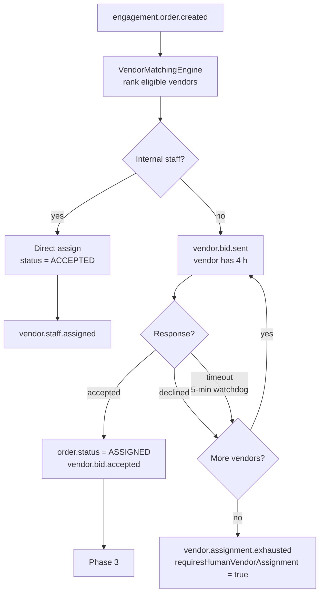
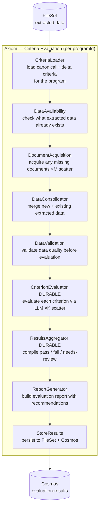
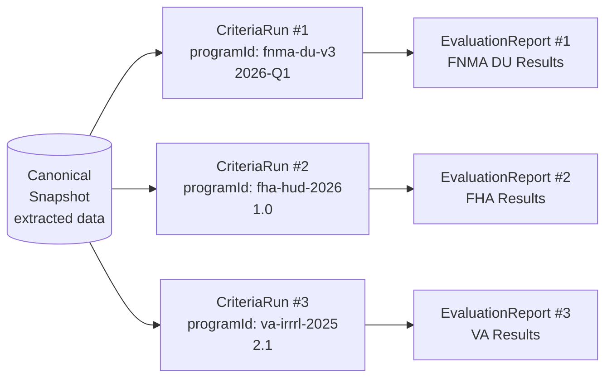
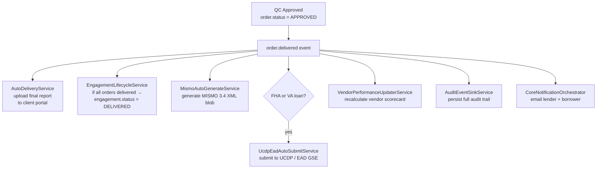
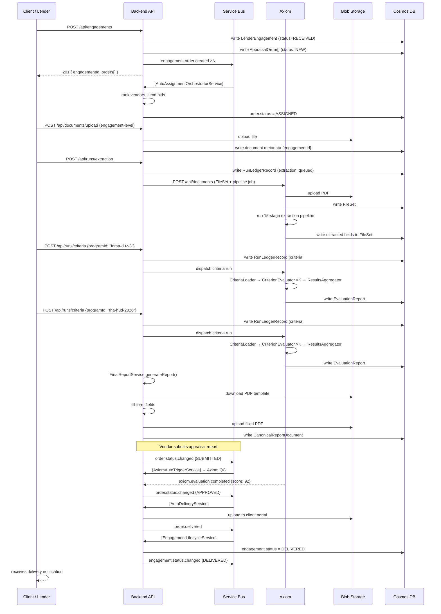

# End-to-End Workflow: Engagement → Orders → Documents → Extraction → Criteria → Report → Export

**Systems involved:** `appraisal-management-backend` · `axiom`  
**Event bus:** Azure Service Bus topic `appraisal-events`  
**Storage:** Azure Cosmos DB · Azure Blob Storage

---

## Overview

```
┌───────────────────────────────────────────────────────────────────────────────┐
│                          Full Lifecycle at a Glance                           │
│                                                                               │
│  1. Create Engagement         POST /api/engagements                           │
│         │                                                                     │
│  2. Add Orders                (auto-created per loan product)                 │
│         │                                                                     │
│  3. Upload Documents          POST /api/documents/upload (backend)            │
│         │                     POST /api/documents        (axiom)              │
│         │                                                                     │
│  4. Run Extraction            POST /api/runs/extraction  (backend → axiom)    │
│         │                     → FileSet created, PDF pipeline queued          │
│         │                                                                     │
│  5. Run Criteria (N sets)     POST /api/runs/criteria ×N                      │
│         │                     → Each programId = one CriteriaRun             │
│         │                                                                     │
│  6. Generate Report           ReportGenerator actor + FinalReportService      │
│         │                                                                     │
│  7. Export / Deliver          AutoDeliveryService → client portal             │
│                               MISMO 3.4 XML blob                              │
└───────────────────────────────────────────────────────────────────────────────┘
```

---

## Phase 1 — Create an Engagement

An **Engagement** is the aggregate root for all valuation work on one or more loans. It is what a lender (client) hires the AMC to produce.

```
POST /api/engagements
Body:
  {
    client: { clientId, clientName, loanNumber, borrowerName },
    loans: [
      {
        propertyAddress: ...,
        products: [{ productType: "full_appraisal" }, ...]
      }
    ],
    priority: "ROUTINE" | "RUSH",
    clientDueDate: ...,
    totalEngagementFee: ...
  }
```

**What happens internally:**

```
EngagementController
    │
    ├─ DuplicateOrderDetectionService  ← advisory check (same address+borrower)
    │
    ├─ EngagementService.createEngagement()
    │     • Generates engagementId + engagementNumber
    │     • Sets status = RECEIVED
    │     • Embeds EngagementLoan[] (one per loan)
    │     • Each EngagementLoan has EngagementProduct[] (one per product)
    │     • Writes LenderEngagement document to Cosmos (engagements container)
    │
    ├─ For each loan product → OrderManagementService.createOrder()
    │     • Writes AppraisalOrder to Cosmos (orders container)
    │     • status = NEW,  engagementId = <id>
    │
    └─ Publishes engagement.order.created  (one per order)
```

**Engagement lifecycle states:**

```
RECEIVED → ACCEPTED → IN_PROGRESS → QC → DELIVERED
                                ↘         ↗
                              REVISION
          (any active state can go to ON_HOLD or CANCELLED)
```

**Loan lifecycle states (nested inside Engagement):**

```
PENDING → IN_PROGRESS → QC → DELIVERED
                           ↘ CANCELLED
```

---

## Phase 2 — Add Orders (Vendor Assignment Loop)

Orders are created automatically in Phase 1, one per `EngagementProduct`. The bid loop begins immediately.



If `engagementLetterAutoSend: true`, the `EngagementLetterAutoSendService` simultaneously:
1. Selects the template for the product type
2. Renders the letter with order placeholders (scope of work, fee, deliverables, due date)
3. Creates a signing request
4. Dispatches the letter to the vendor

---

## Phase 3 — Upload Documents to the Engagement

Documents can be attached at two scopes:

| Scope | How | Stored As |
|---|---|---|
| Engagement-level | `POST /api/documents/upload` with `engagementId` | `documents` container, partition `/tenantId`, field `engagementId` |
| Order-level | `POST /api/documents/upload` with `orderId` | `documents` container, field `orderId` |

Both are returned together by `GET /api/engagements/:id/documents` (deduped union).

**Upload flow (backend DocumentService):**

```
Client  ──POST /api/documents/upload──►  DocumentService
                                              │
                                    ┌─────────┴──────────┐
                                    │                    │
                              BlobStorageService    CosmosDbService
                              (upload binary)       (write metadata)
                                    │                    │
                              Blob path:            documents container:
                              {tenantId}/{orderId}/  { id, orderId, engagementId,
                              {uuid}.{ext}            documentType, blobPath,
                                                       status, version, ... }
```

**Document types tracked in the system:**

- `APPRAISAL_REPORT` — vendor-supplied report (PDF/URAR form)
- `ENGAGEMENT_LETTER` — generated and sent to vendor on assignment
- `PHOTOS` — property photo sets
- `FLOOR_PLAN`, `COMPARABLE_PHOTOS`, etc.

---

## Phase 4 — Run Extraction (Document → Structured Data)

Once documents are uploaded, structured data is extracted from them using the Axiom pipeline. This step converts raw PDFs into field-level data that criteria can be evaluated against.

### Option A: Backend triggers Axiom via RunLedger

```
POST /api/runs/extraction
Body: { documentId, schemaKey, engagementId, engineTarget: "AXIOM" }

RunLedgerService.createExtractionRun()
    └─ persists RunLedgerRecord (status=queued) to aiInsights container
    
EngineDispatchService → AxiomEngineAdapter.dispatchExtraction()
    └─ calls Axiom POST /api/documents  (creates FileSet, queues job)
```

### Option B: Upload directly to Axiom

```
POST /api/documents   (Axiom API)
Body: multipart PDF  +  { subClientId, clientId, programId, programVersion, fileSetId }

Axiom:
  • Uploads PDF to Blob (raw-files container)
  • Creates FileSet record in Cosmos
  • Enqueues BullMQ job → PipelineExecutionService
```

### What the Axiom Extraction Pipeline Does

```mermaid
flowchart LR
    subgraph Axiom Pipeline ["Axiom — Complete Document Criteria Pipeline (15 stages)"]
        direction TB
        S1[STAGE 1\nPdfTypeAnalyzer\ndetect text / image / mixed]
        S2[STAGE 2\nPdfTextExtractor\nextract raw text per page]
        S3[STAGE 3\nTextBasedClassification\nclassify each page ×N scatter]
        S4[STAGE 4\nImageBasedClassification\nvision classify image pages ×N]
        S5[STAGE 5\nMultiPageAggregator\ngroup pages into documents]
        S6[STAGE 6\nFileSetDocumentStorage\npersist classified docs]
        S7[STAGE 7\nExtractionRouter\nroute to schema or vision extractor]
        S8[STAGE 8\nStoreExtractedData\npersist field-level data to Cosmos]

        S1 --> S2 --> S3 --> S4 --> S5 --> S6 --> S7 --> S8
    end

    PDF[Raw PDF\nBlob Storage] --> S1
    S8 --> FSD[(FileSet\nCosmos DB\nextracted fields)]
```



**Output:** A `FileSet` record in Cosmos containing per-document extracted fields with confidence scores and source page citations.

---

## Phase 5 — Run Criteria Evaluation (One or More Sets)

Criteria are organized by **program** (`programId` + `programVersion`). You can run multiple criteria sets against the same extracted data — one `CriteriaRun` per program. Each run is independent and auditable.

### Running a Criteria Set

```
POST /api/runs/criteria
Body:
  {
    snapshotId:   "<extraction snapshot id>",
    programKey:   { clientId, subClientId, programId: "fnma-du-v3", programVersion: "2026-Q1" },
    engagementId: "<id>",
    engineTarget: "AXIOM"   // or "MOP_PRIO"
  }
```

To run a **second criteria set** against the same documents, repeat the call with a different `programId`:

```
POST /api/runs/criteria
Body:  { programKey: { programId: "fha-hud-2026", programVersion: "1.0" }, ... }
```

Each call creates a separate `RunLedgerRecord` (type `criteria`) in the `aiInsights` container. Re-running a single step within a criteria run is also supported:

```
POST /api/runs/criteria/:criteriaRunId/steps/:stepKey/rerun
Body: { rerunReason: "..." }
```

### Criteria Evaluation Pipeline (inside Axiom)



### Per-Criterion Result Structure

Each criterion produces:

| Field | Values |
|---|---|
| `result` | `pass` · `fail` · `needs-review` · `not-applicable` · `insufficient-data` |
| `evidence` | specific extracted data points with source document citations |
| `reasoning` | LLM-generated explanation of the decision |
| `confidence` | 0.0 – 1.0 |
| `flags` | secondary warnings or issues |

### Running Multiple Criteria Sets in Parallel



All three criteria runs share the same snapshot and can be dispatched concurrently. Each run generates its own independent `EvaluationReport`.

---

## Phase 6 — Create the Evaluation Report

After criteria evaluation, `ResultsAggregator` and `ReportGenerator` produce a structured report:

```json
{
  "fileSetId": "fs-abc123",
  "programId": "fnma-du-v3",
  "summary": {
    "total": 40,
    "pass": 32,
    "fail": 4,
    "needsReview": 3,
    "notApplicable": 1,
    "passRate": 80.0
  },
  "criticalFailures": [
    {
      "criterionId": "APPR-1033-002",
      "code": "PARCEL_ID_MATCHES_TITLE",
      "reasoning": "Parcel ID on URAR (123-456-789) does not match title commitment (123-456-000)"
    }
  ],
  "categoryBreakdown": {
    "propertyIdentification": { "pass": 3, "fail": 1 },
    "formCompliance":         { "pass": 4, "fail": 0 },
    "comparableSalesAnalysis":{ "pass": 7, "fail": 2 }
  },
  "recommendations": ["..."],
  "auditTrail": [...]
}
```

**Final Appraisal Report (PDF)** is generated separately by `FinalReportService`:

```
POST /api/reports   (backend)
    │
    FinalReportService.generateReport()
        │
        ├─ Select PDF template from pdf-report-templates blob container
        ├─ FillPdf: fill form fields from QC / order data
        ├─ Upload filled PDF to orders blob container:
        │     path: {clientId}/{orderId}/{reportType}_{address}.pdf
        ├─ Write CanonicalReportDocument to reporting container
        └─ Patch order.reportId
```

---

## Phase 7 — Export and Deliver

### Axiom AI QC Scoring (automated)

When a vendor submits the report (`order.status = SUBMITTED`), `AxiomAutoTriggerService` fires. The criteria evaluation score determines routing:

| Axiom Score | Outcome |
|---|---|
| ≥ 90 | Auto-approved — proceeds directly to delivery |
| 70–89 | Flagged for human QC review with AI notes |
| < 70 | Flagged with escalation |
| timeout | Falls back to standard human QC |

### Human QC Review (Phase 5)

Analyst reviews the criteria results and the appraisal report. Actions:

- **Approve** → triggers delivery
- **Request revision** → order returned to vendor
- **Escalate** → supervisory review layer added

### Delivery and Export



### Downloading the Report

```
GET /api/reports/pdf
  ?clientId=<id>&orderId=<id>&reportFileName=<name>

  → BlobStorageService proxies the PDF via Managed Identity
  → Returns stream with Content-Type: application/pdf
```

### Final State After Export

```
AppraisalOrder.status          = DELIVERED
LenderEngagement.status        = DELIVERED   (when all loans delivered)
Blob (orders container)        = {clientId}/{orderId}/{reportType}_{address}.pdf
Blob (reporting container)     = MISMO 3.4 XML
Cosmos (reporting)             = CanonicalReportDocument
Cosmos (evaluation-results)    = EvaluationReport per programId
Cosmos (aiInsights)            = RunLedgerRecord[] (extraction + all criteria runs)
vendor performance doc         = updated
UCDP / EAD submission          = confirmed (if FHA/VA)
```

---

## Complete Sequence Diagram



---

## Key API Reference

| Action | Endpoint | Service |
|---|---|---|
| Create engagement | `POST /api/engagements` | `EngagementController` |
| Get engagement | `GET /api/engagements/:id` | `EngagementController` |
| List engagement documents | `GET /api/engagements/:id/documents` | `EngagementService.getDocuments()` |
| List engagement orders | `GET /api/engagements/:id/vendor-orders` | `EngagementService.getVendorOrders()` |
| Upload document | `POST /api/documents/upload` | `DocumentService` |
| Start extraction run | `POST /api/runs/extraction` | `RunLedgerService` + `AxiomEngineAdapter` |
| Start criteria run | `POST /api/runs/criteria` | `RunLedgerService` + Axiom/MopPrio dispatch |
| Rerun a criteria step | `POST /api/runs/criteria/:id/steps/:key/rerun` | `RunLedgerService.rerunCriteriaStep()` |
| Generate final report | `POST /api/reports` | `FinalReportService` |
| Download report PDF | `GET /api/reports/pdf?clientId=&orderId=&reportFileName=` | `ReportsController` |
| Change engagement status | `PATCH /api/engagements/:id/status` | `EngagementService.changeStatus()` |
