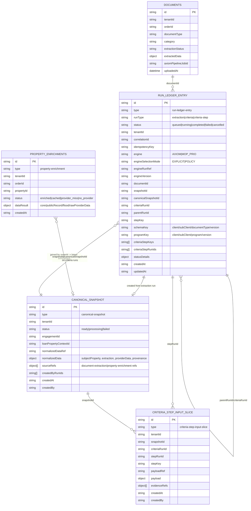

# Run Ledger Canonical Data Model (Compact Reference)

This is the canonical reference for the orchestration data model across extraction, canonical merge, and criteria-step execution.

## Diagram

## Relationship Notes

- One document can produce many run-ledger entries over time (repeated extraction and repeated criteria cycles).
- One extraction run creates one canonical snapshot (current pattern), and criteria runs attach to that snapshot.
- One criteria run fans out to many criteria-step runs; each step run has one persisted input-slice record.
- Canonical snapshot merge uses document extractedData + latest property-enrichment for the same order.
- Provenance is stored in canonical snapshot sourceRefs and normalizedData.provenance; step-level evidence is stored in criteria-step-input-slice evidenceRefs.

## Storage Containers

- run-ledger-entry: aiInsights
- canonical-snapshot: aiInsights
- criteria-step-input-slice: aiInsights
- documents: documents
- property-enrichments: property-enrichments

## Container Map (Operational)

| Domain Record | Container | Partitioning / Keying | Notes |
|---|---|---|---|
| run-ledger-entry | aiInsights | tenant-scoped | Extraction, criteria, and criteria-step runs; supports reruns via new run ids + idempotency controls |
| canonical-snapshot | aiInsights | tenant-scoped | Canonical merged dataset for a specific extraction cycle |
| criteria-step-input-slice | aiInsights | tenant-scoped | Persisted tactical payload + evidence refs per criteria step run |
| ai evaluation artifacts (legacy/parallel) | aiInsights | tenant/order scoped | Existing Axiom result artifacts may coexist with run-ledger records |
| document metadata | documents | tenant-scoped, id | Upload metadata, extraction status, extractedData |
| property enrichment artifacts | property-enrichments | tenant/order scoped | Bridge/Attom/core/public/flood provider artifacts |

## Document Attachment Model: Current vs Target

### Current behavior

- Documents are stored in the documents container.
- Metadata supports orderId and also generic entityType/entityId.
- This means a document can be attached to an engagement entity (entityType=engagement, entityId=<engagementId>) instead of only to a single order.
- UI already surfaces engagement-level and linked-order documents together in aggregated views.

### Gap you identified (valid)

- There is no explicit many-to-many "document references multiple orders" mapping record today.
- Reuse across orders is currently implicit via engagement-level attachment + query/aggregation logic.
- If you need hard auditable per-order references to the same document, a dedicated association model is still needed.

### Recommended target model

- Keep canonical document metadata in documents.
- Add a dedicated association record type (for example document-association) to represent:
  - documentId
  - engagementId
  - zero-to-many referencedOrderIds (or one row per order link)
  - referenceType (primary, supporting, inherited)
  - createdAt/createdBy/audit fields
- This makes cross-order document reuse explicit, queryable, and auditable without duplicating the actual document.

## Journey Confidence Gates (Release Blockers)

Use this matrix as a required pre-release gate for "fully wired" run-ledger journeys.

| Journey Stage | Required Checks | Gate Type |
|---|---|---|
| Upload / attach docs | Upload succeeds, document metadata persisted, entity/order linkage visible in UI | Frontend integration + backend API |
| Extraction run trigger | `POST /api/runs/extraction` accepted with idempotency + correlation headers | Contract test |
| Extraction monitoring | Run appears in list/get endpoints with state transitions (`queued/running/completed/failed`) | API + UI integration |
| Criteria run trigger | `POST /api/runs/criteria` creates parent + step runs and links snapshot | Contract + unit |
| Step rerun / resubmission | `POST /api/runs/criteria/:id/steps/:stepKey/rerun` persists new step run and step-input refs | Unit + integration |
| Refresh status | `POST /api/runs/:runId/refresh-status` updates run status deterministically | Contract |
| Results artifact retrieval | `GET /api/runs/:runId/snapshot` and `GET /api/runs/:runId/step-input` return expected payloads or typed 4xx | Contract + unit |
| Results artifact viewing | UI details panel renders run record + snapshot + criteria-step payload/evidence, with loading/error/empty states | Frontend integration |
| Data integrity invariants | No criteria-step run without retrievable step-input slice; no criteria run without linked snapshot; no 500s on artifact endpoints | Invariant tests + canary |

### Minimum release gate pass criteria

- All contract tests for run-ledger endpoints pass.
- All run-ledger unit/integration tests pass.
- Focused UI journey tests for artifact panels pass.
- Full frontend and backend suites pass.
- Synthetic canary confirms list + artifact retrieval endpoints are healthy in deployed environment.
