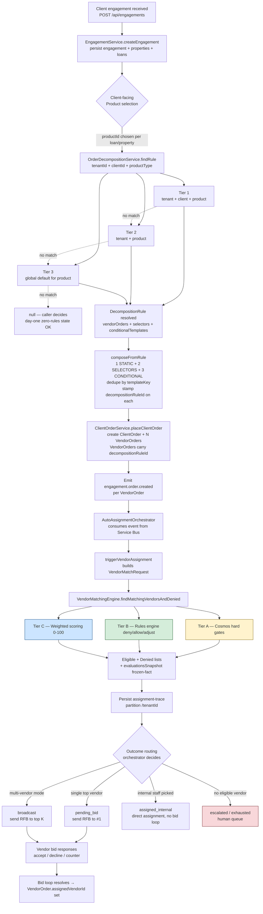

# Engagement → Vendor Broadcast — End-to-End Flow

**Created:** 2026-05-12
**Scope:** Diagrams + criteria reference for the full canonical path from a client engagement landing in AMS through to vendor bids going out. Captures the **actual** vendor-matching criteria as shipped, not a wish list.

---

## 1. High-level flow

---

## 2. Decomposition lookup precedence (most-specific wins)

`OrderDecompositionService.findRule(tenantId, clientId, productType)` walks three tiers in order. First hit wins. **No match returns `null` — that's an expected outcome, not an error** (day-one zero-rules tenants are supported).

| Tier | Match key | Container query | Purpose |
|---|---|---|---|
| 1 | `tenantId` + `clientId` + `productType` | `c.tenantId = @t AND c.clientId = @c AND c.productType = @p` | Tenant-and-client override (e.g. "Chase RetailFlow gets a different decomposition than Chase Wholesale") |
| 2 | `tenantId` + `productType` (no clientId on row) | `c.tenantId = @t AND c.productType = @p AND (NOT IS_DEFINED(c.clientId) OR c.clientId = null)` | Tenant default |
| 3 | `tenantId = GLOBAL_DEFAULT_TENANT` + `productType` + `default = true` | Platform-wide default | Last resort |

The matched rule's `autoApply` field is the contract for a future "auto-place" path: today **every** match is treated as suggested (Phase 1 advisory mode).

## 3. Decomposition composition (`composeFromRule`)

The matched rule produces a **union** of VendorOrderTemplates from three sources, deduped by `templateKey` (first-wins so static templates are stable):

1. **STATIC** — `rule.vendorOrders[]` — always included.
2. **SELECTORS** — `rule.selectors[].include[]` whose `when` clause matches the `productOptions` bag (AND across keys, case-insensitive for strings).
3. **CONDITIONAL** — `rule.conditionalTemplates[].include[]` whose `condition` evaluates true against the canonical view (uses the shared `review-flag-condition` evaluator).

Every emitted template is stamped with `decompositionRuleId: rule.id` so the downstream VendorOrder carries provenance back to the rule that emitted it. This is what `OrderDecompositionAnalyticsService` reads to produce per-rule fire counts.

---

## 4. Vendor-matching criteria — what's actually shipped

`VendorMatchingEngine.findMatchingVendorsAndDenied()` runs **three tiers in order**. Each tier can drop a vendor; only vendors that survive all three reach the bid stage.

### Tier A — Cosmos hard gates (eligibility query)

These run as the initial vendor selection query. Failure → vendor never reaches the rules engine or scorer.

| Gate | Source | Behavior |
|---|---|---|
| **Tenant match** | `WHERE c.tenantId = @tenantId` | Cross-tenant vendors are invisible. |
| **Entity type** | `WHERE c.entityType = 'vendor'` | Excludes non-vendor docs in the same container. |
| **Active flag** | `WHERE c.isActive = true` | Soft-deleted / paused vendors excluded. |
| **State coverage** | `EXISTS(... serviceAreas WHERE sa.state = @state)` OR no `serviceAreas` defined | Property state must be in vendor's coverage map. Missing `serviceAreas` is treated as "any state". |
| **Product allow-list** | `vendor.eligibleProductIds` (if present, must include `request.productId`) | Post-filter after the query. Vendors without an allow-list bypass this gate. |

### Tier B — Rules engine (per-tenant rule pack)

Each surviving vendor is evaluated through the per-tenant `vendor-matching` rule pack (provider: `homegrown` / `mop` / `mop-with-fallback`). Output per vendor: `{ eligible, scoreAdjustment, appliedRuleIds, denyReasons }`. **Fails open** — if the provider unreachable, all vendors pass with no score adjustments.

The shipped seed pack contains these rule patterns (5 rules — current default):

| Rule name | Pattern | Effect |
|---|---|---|
| `Example_Blacklist_Vendor_Specific` | Conditions: `vendor_id == "vendor-id-to-block"` | Asserts `vendor_denied` with reason "Vendor blacklisted by tenant policy". |
| `Example_Min_Performance_Score` | Performance score < threshold | Denies vendor with "Performance below tenant minimum". |
| `Example_Max_Distance_Miles` | `vendor_distance > N` | Denies vendor with "Vendor distance exceeds N miles". |
| `Example_Score_Boost_Preferred_State` | Property state in vendor's preferred coverage | Adds positive score adjustment. |
| `Example_Whitelist_Override` (salience 250) | `vendor_id == "vip-vendor-id-here"` | Asserts `vendor_whitelist_override` — overrides downstream deny rules. Higher salience runs first. |

Operators author additional rules through `/decision-engine/rules/vendor-matching`. Every save creates an immutable new version + audit row + push-on-write to the upstream evaluator (when configured).

### Tier C — Capability gate (inside the scorer)

Before any scoring math runs, `scoreVendor()` checks that every entry in `request.requiredCapabilities` is present in `vendor.capabilities`. Missing → vendor scored `0` with reason `"Missing required capabilities: …"`. Effectively a fourth hard gate, but it lives in the scorer because it operates on the same enriched vendor record.

### Tier D — Weighted scoring (0-100)

`v1-30/25/20/15/10` weights. Each component is a 0-100 sub-score; the weighted sum is the base; the rules engine's `scoreAdjustment` is then applied and clamped to [0, 100].

| Component | Weight | Inputs | Bucketing |
|---|---|---|---|
| **Performance** | 30% | `VendorPerformanceMetrics.overallScore` | Passed through directly. 0 when no metrics doc exists. |
| **Availability** | 25% | `VendorAvailability` (load, capacity, blackout dates) | `availableSlots ≥ 5` → 100; `≥ 3` → 85; `≥ 1` → 70; `utilization < 0.9` → 50; else 0. **Forced to 0** when `dueDate` falls inside any of `availability.blackoutDates`. Internal staff get a synthesized availability snapshot from `activeOrderCount`/`maxConcurrentOrders` so they don't lose 25% unfairly. |
| **Proximity** | 20% | Property geocoded vs vendor `location` | `≤ 25 mi` → 100; `≤ 75 mi` → 80; `≤ 150 mi` → 60; `≤ 300 mi` → 40; else 0. **+10 bonus** when property state is in `vendor.geographicCoverage.preferred.states`. Falls back to state-only matching (70 / 40) when no geocoding available. |
| **Experience** | 15% | `vendor.specializations`, `performance.propertyTypeExpertise`, `vendor.productGrades` | Base 50. +30 if `propertyType` in specializations. +20 / +15 / +10 by order count for that property type (≥50 / ≥20 / ≥5). **Product-grade bonus** by `productGrades[productId].grade`: trainee 0, proficient 5, expert 10, lead 15. Clamped to 100. |
| **Cost** | 10% | `vendor.averageFee` vs `request.budget` and `clientPreferences.maxFee` | Over `maxFee` → 0 (effective deny). Under 80% of budget → 100; ≤ 100% → 85; ≤ 110% → 70; ≤ 120% → 50; else 25. No fee data → neutral 75. |

### Provenance — what gets persisted

Every match produces an `assignment-trace` doc in Cosmos partitioned by `/tenantId`. The trace carries:

- `matchRequest` (snapshot of the inputs)
- `rankedVendors[]` with full `MatchExplanation` (scoreBreakdown, appliedRuleIds, denyReasons, scoreAdjustment, weightsVersion)
- `deniedVendors[]` with reasons
- `evaluationsSnapshot[]` — **frozen-fact bundle** of `{vendor, order}` pairs that drove this decision. Lets Sandbox replay re-evaluate proposed rules against the SAME facts, not whatever's current.
- `outcome` (`pending_bid` / `broadcast` / `assigned_internal` / `escalated` / `exhausted`)
- `rankingLatencyMs`
- Optional override fields when an operator intervenes (`overrideOutcome`, `overrideReason`, `overriddenBy`, `overriddenAt`)

---

## 5. Outcome → broadcast

The orchestrator's outcome decision (final node in the diagram) is what controls how the bid actually goes out:

| Outcome | Trigger | What happens next |
|---|---|---|
| `pending_bid` | Single top vendor selected (default mode) | One RFB sent to ranked[0]. Bid timer starts. Decline / timeout cascades to ranked[1]. |
| `broadcast` | Multi-vendor / pool-based assignment mode | RFB broadcast to top K vendors in parallel. First acceptance wins. |
| `assigned_internal` | Top match is staff with `staffType: 'internal'` | Direct assignment, no bid loop. Order goes straight to in-progress. |
| `escalated` | No eligible vendor returned (or all rules denied) | VendorOrder routed to human review queue. Audit trail explains every denial. |
| `exhausted` | All ranked vendors timed out / declined | Same destination as escalated; distinguished in analytics so ops can tell "no rules matched" from "ran the ladder, nobody bit". |

Every transition writes an event to Service Bus (`engagement.order.assigned`, `vendor.order.bidsent`, etc.) so downstream consumers (notifications, billing, dashboards) can react without polling.

---

## 6. Where this surfaces in the operator workspace

- **Decision Engine → Rules → Vendor Matching** — authoring of the per-tenant rule pack (Tier B). Includes Sandbox replay, Analytics, Sandbox **Simulate impact** (projects pack-change effect on in-flight bids), and History **Compare versions** (rev-15 scope expansions).
- **Decision Engine → Decisions → Vendor Matching** — listing of recent `assignment-traces` with override surface.
- **Decision Engine → Rules → Order Decomposition** — authoring of the decomposition rules (sections 2-3). Same workspace shape; different fact catalog.
- **Order detail → Assign To tab** — `AutoAssignmentStatusPanel` renders the per-order timeline + flow diagram of the trace's tier-A/B/C decisions, with **Replay** and **Override** buttons on every entry.

---

## 7. Catalogs the rules engine reads (fact_ids exposed to operators)

Operators authoring rules in the workspace get a typed variable catalog. Today's vendor-matching catalog (from the FE `categoryDefinitions.ts`):

- `vendor_id` (string)
- `vendor_capabilities` (string[])
- `vendor_states` (string[])
- `vendor_performance_score` (number, 0-100)
- `vendor_distance` (number, miles)
- `vendor_license_type` (string)
- `order_product_type` (string)
- `order_property_state` (string)
- `order_value_usd` (number, optional)

Operators map these into Prio-format conditions (`{ "==": [{var:"vendor_id"}, "x"] }`) + actions (`assert vendor_denied { reason }`, `score_adjustment N`, `assert vendor_whitelist_override`). The shared `validatePrioRulePack` enforces shape on every save.
