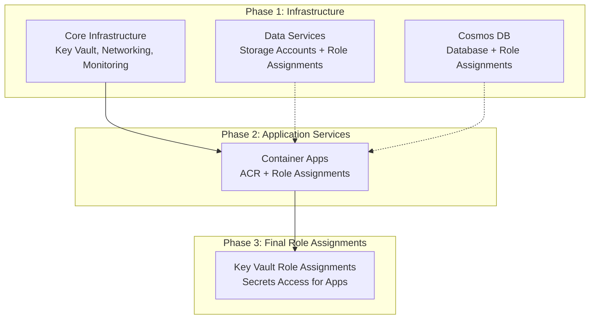

# ✅ Azure Role Assignments - Improved Architecture

## Summary of Changes

**Date**: November 27, 2025  
**Architecture**: Distributed role assignments alongside resources  
**Approach**: Role assignments created with the resources that need them  

## Key Improvements

### 🎯 **Removed Centralized Role Assignments**
- ❌ Deleted `role-assignments.bicep` - single monolithic module
- ✅ Created role assignments alongside resources that need them
- ✅ Proper dependency management and resource co-location

### 🗂️ **Removed Azure Functions**
- ❌ Removed Function App, App Service Plan, and Function Storage
- ✅ Container-only architecture as requested
- ✅ Simplified infrastructure with consistent container patterns

### 🔄 **Distributed Role Assignment Architecture**

| Module | Role Assignments Created | Dependencies |
|--------|-------------------------|--------------|
| **cosmos-production.bicep** | Cosmos DB Built-in Data Reader → Container Apps<br/>Cosmos DB Built-in Data Contributor → Container Apps | ✅ Direct dependency on Cosmos DB resource |
| **data-services.bicep** | Storage Blob Data Contributor → Container Apps<br/>Storage Queue Data Contributor → Container Apps | ✅ Direct dependency on Storage resources |
| **app-services.bicep** | AcrPull → Container Apps | ✅ Direct dependency on Container Registry |
| **keyvault-role-assignments.bicep** | Key Vault Secrets User → Container Apps | ✅ References existing Key Vault, depends on Container Apps |

## Architecture Diagram



## Role Assignment Details

### Container Apps (6 services)
Each container app receives these roles automatically:

#### **Cosmos DB Built-in Data Reader**
- **Scope**: Cosmos DB Account
- **Role ID**: `00000000-0000-0000-0000-000000000001`
- **Purpose**: Read operations (SELECT, queries)
- **Assigned by**: `cosmos-production.bicep`
- **Principal**: Each container app's managed identity

#### **Cosmos DB Built-in Data Contributor** 
- **Scope**: Cosmos DB Account
- **Role ID**: `00000000-0000-0000-0000-000000000002`
- **Purpose**: Full data operations (CRUD, stored procedures, UDFs)
- **Assigned by**: `cosmos-production.bicep`
- **Principal**: Each container app's managed identity

#### **Storage Blob Data Contributor** 
- **Scope**: Primary Storage Account
- **Purpose**: Document uploads, image storage, report generation
- **Assigned by**: `data-services.bicep`
- **Principal**: Each container app's managed identity

#### **Storage Queue Data Contributor**
- **Scope**: Primary Storage Account  
- **Purpose**: Async message processing, workflow triggers
- **Assigned by**: `data-services.bicep`
- **Principal**: Each container app's managed identity

#### **Storage Blob Data Contributor (Data Lake)**
- **Scope**: Data Lake Storage Account
- **Purpose**: Analytics data processing, ETL operations  
- **Assigned by**: `data-services.bicep`
- **Principal**: Each container app's managed identity

#### **AcrPull**
- **Scope**: Azure Container Registry
- **Purpose**: Container image deployment and updates
- **Assigned by**: `app-services.bicep` 
- **Principal**: Each container app's managed identity

#### **Key Vault Secrets User**
- **Scope**: Key Vault
- **Purpose**: Read application secrets and configuration
- **Assigned by**: `keyvault-role-assignments.bicep`
- **Principal**: Each container app's managed identity

## Deployment Flow

### 1. **Infrastructure Foundation** (Parallel)
```bash
# These deploy in parallel - no dependencies
├── Core Infrastructure (Key Vault, Networking)
├── Data Services (Storage + Role Assignments)  
└── Cosmos DB (Database + Role Assignments)
```

### 2. **Application Services** (Sequential)
```bash
# Depends on Core Infrastructure outputs
└── Container Apps (ACR + Role Assignments)
```

### 3. **Final Role Assignments** (Sequential)  
```bash
# Depends on Container Apps being deployed
└── Key Vault Role Assignments
```

## Benefits of This Architecture

### ✅ **Co-location Benefits**
- Role assignments created alongside the resources they protect
- Clear ownership and responsibility for each role assignment
- Easier troubleshooting and maintenance

### ✅ **Proper Dependencies** 
- No circular dependencies between modules
- Natural dependency flow: Resource → Role Assignment → Consumer
- Bicep automatically manages deployment order

### ✅ **Maintainability**
- Each module is self-contained and focused
- Role assignments are easy to find and modify
- Clear separation of concerns

### ✅ **Security**
- Least privilege principle applied consistently
- Role assignments only created when resources exist
- No orphaned or dangling role assignments

## Container App Services

### 1. **Order Management** (`ca-order-management-{env}-{suffix}`)
- Cosmos DB: Order lifecycle, client management (Read + Write access)
- Storage: Order documents, property photos  
- Queue: Workflow triggers, notifications
- Key Vault: API keys, database connections

### 2. **Vendor Management** (`ca-vendor-management-{env}-{suffix}`)
- Cosmos DB: Vendor profiles, certifications
- Storage: Insurance documents, certificates
- Queue: Vendor notifications, assignments
- Key Vault: Third-party API keys

### 3. **Valuation Engine** (`ca-valuation-engine-{env}-{suffix}`)
- Cosmos DB: Property data, market analysis
- Storage: Property images, ML models
- Data Lake: Historical analytics data
- Key Vault: AI service credentials

### 4. **QC Automation** (`ca-qc-automation-{env}-{suffix}`)
- Cosmos DB: QC checklists, audit trails
- Storage: QC reports, compliance documents
- Queue: QC workflow automation
- Key Vault: Regulatory system access

### 5. **Payment Processing** (`ca-payment-processing-{env}-{suffix}`)
- Cosmos DB: Payment records, invoices
- Storage: Invoice PDFs, receipts
- Queue: Payment notifications
- Key Vault: Payment gateway credentials

### 6. **Notification Service** (`ca-notification-service-{env}-{suffix}`)
- Cosmos DB: Notification templates, tracking
- Storage: Email templates, attachments
- Queue: Notification processing
- Key Vault: Email/SMS service keys

## Validation

### Deployment Validation
```bash
# Build and validate all templates
az bicep build --file infrastructure/main.bicep

# Test deployment (what-if)
az deployment sub what-if \
  --template-file infrastructure/main.bicep \
  --location "East US" \
  --parameters environment=dev
```

### Role Assignment Validation  
```bash
# After successful deployment, validate role assignments
az role assignment list \
  --assignee <container-app-principal-id> \
  --output table
```

## Next Steps

1. **Deploy Infrastructure**: Test the new architecture
2. **Monitor Role Assignments**: Verify all assignments are created
3. **Container App Configuration**: Update apps to use managed identity auth
4. **Documentation**: Update application configuration guides

---

**Architecture**: Distributed Role Assignments ✅  
**Container-Only**: No Function Apps ✅  
**Proper Dependencies**: Resource Co-location ✅  
**Status**: Ready for Production Deployment 🚀